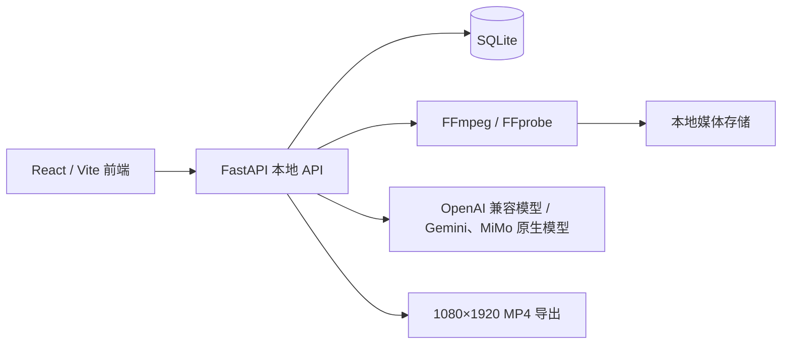

# 架构

## 组件

前端通过 Vite 的 `/api` 代理访问本地 API。后端默认监听 `127.0.0.1:8001`，可通过 `RADIO_CATCH_API_PORT` 调整；所有素材、关键帧、缩略图和导出文件都保存在本机。

## 媒体与理解流程

1. `POST /api/media/imports` 接收视频，计算 SHA-256；相同哈希直接返回已存在素材。
2. 媒体任务用 FFprobe 读取时长、帧率、尺寸、方向和音轨，再用 FFmpeg 生成缩略图与自适应关键帧。
3. 关键帧路径和时间戳保存为 `ClipAnalysis(mode=adaptive_frames)`，作为审核和模型理解的证据。
4. `GET/PATCH /api/project-settings` 读取或保存项目级 `business_context`。新项目默认使用柠檬商家背景；该背景仅说明标签用途，不能作为模型判断画面事实或宣传卖点的依据。
5. `POST /api/clips/{clip_id}/analyze` 默认将关键帧和时间戳发送至 OpenAI 兼容模型；`protocol=gemini` 将原始视频及其内嵌音轨作为 Gemini 原生 `inline_data` 发送；`protocol=mimo` 通过 MiMo 的 OpenAI 兼容 Chat Completions 接口发送 `video_url` Base64 数据，保存结构化 `ClipAnalysis`。三种协议均使用项目级业务背景。
6. 人工审核修改或确认分析结果。`tags.commerce_roles` 可标记 `hook`、`product_proof`、`usage`、`cta`，但必须由画面或音频证据支持。只有审核通过的素材可进入实验时间线。
7. `PATCH /api/clips/{clip_id}/metadata` 只修改最新分析的摘要、菜品、片段角色、最佳出现时间、可用区间和结构化标签，不改变审核状态。最佳出现时间为不早于 0 秒且不超过素材时长的秒数，可传 `null` 清空；`tags` 为完整替换（本地缩略图路径由服务端保留）。`POST /api/clips/{clip_id}/analyze` 会新增一版分析并继承当前审核状态。素材详情与列表始终投影最新分析版本，旧版本仍保留用于追溯。
8. 素材库详情通过 `GET /api/media/clips/{clip_id}/video` 播放完整原视频。接口只能按已登记的素材 ID 读取仍位于本地媒体存储目录内的文件，不返回或接受任意本地路径。
9. `POST /api/remix-plans` 为同菜品的已审核素材生成多模态混剪计划：服务端先按标签、角色、质量和置信度预筛最多 24 条候选，再临时向规划模型发送摘要、结构化标签、封面和最多 3 张关键帧。每张图片优先经 FFmpeg 在内存中缩放为最长边 512 像素、最大 256 KiB 的 JPEG，避免多素材 Base64 请求过大；转换失败时只允许使用原本已不超过该上限的图片。模型返回少量叙事策略及其实际 EDL 变体。压缩图及其 Base64 只存在于本次模型请求，不写入数据库、响应、日志或用量记录。

OpenAI 兼容模型继续使用可移植的关键帧理解。兔子 API Gemini 与小米 MiMo 原生适配器仅接受 `auto` 或 `native` 模式，不回退关键帧；它们会在本地检查配置的媒体大小，且不会持久化或记录原始视频 Base64 数据。MiMo 仅接受 MP4、MOV、AVI 或 WMV，并额外将包含数据 URL 前缀的 Base64 请求限制在 50 MB；界面默认将原文件限制为 37 MB，以在编码膨胀后保留余量。

## 数据模型

| 实体 | 作用 |
| --- | --- |
| `ProjectSettings` | 项目级商家业务背景；不保存模型连接信息或密钥。 |
| `ModelConfig` / `ModelTaskAssignment` / `ModelUsage` | 加密的模型配置、任务路由与调用记录；原生媒体上限按配置保存。 |
| `Clip` / `ClipAnalysis` | 原始视频与可追溯的媒体证据、AI/人工标签；`Clip.review_status` 是当前审核决策，每次重识别的新分析继承该决策。 |
| `BackgroundTask` | 可查询的持久化工作流任务。 |
| `Experiment` / `Render` | 单变量实验定义和带唯一 `video_id` 的成片 EDL。 |
| `PlatformMetric` | 按 `video_id` 关联的平台数据观测值。 |

## 成片与分析规则

- `POST /api/experiments` 校验素材存在、审核通过、同菜品、截取区间、速度和总时长（20–60 秒）。
- `POST /api/remix-plans` 使用 `remix_planning` 任务模型（未分配时回退默认模型），且该模型必须支持图片输入。策略是高层叙事模板；变体是实际导出的 EDL。同一策略可替换不同 source clip 生成多个变体，但完全相同的 EDL 会被丢弃；素材不足时返回较小的规划数和说明，不硬凑数量。
- `POST /api/renders/{render_id}/run` 用硬切生成 1080×1920、H.264/AAC MP4，并保留 `edit_decision_list`；导出后会从约 15% 时刻提取 JPEG 成片封面。封面是可再生的本地派生文件，提取失败不会使成片导出失败。
- 后期审核使用 MiMo 原生视频时，完整媒体只在请求内存中以 `video_url` 发送；每个文件须先通过配置的原文件上限与 50 MB Base64 data URL 上限校验。审核结果可以保存为事实摘要，但不得保存请求体、原视频 Base64 或 API Key。
- `GET /api/renders/{render_id}/video` 仅在成片完成后以内联方式播放对应 MP4；`GET /api/renders/{render_id}/thumbnail` 返回成片封面，并会为历史成片按需补生成封面。
- `GET /api/renders/{render_id}/download` 仅在成片完成后提供对应 MP4 下载。上述成片媒体接口均校验文件仍位于配置的导出目录中，不接受任意本地路径。
- 数据分析优先使用与发布后 72 小时差值最小的观察记录；播放量低于 500 的记录不进入规律评估。
- 同一方向需在至少 3 个独立实验中重复才标记为“已验证规律”，其余为“候选规律”。
