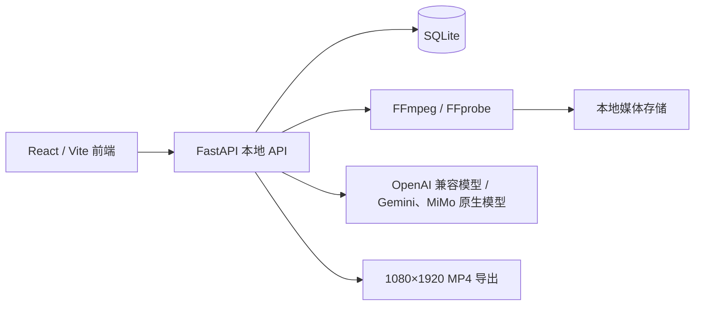

# 架构

## 组件

前端通过 Vite 的 `/api` 代理访问本地 API。后端默认监听 `127.0.0.1:8000`；所有素材、关键帧、缩略图和导出文件都保存在本机。

## 媒体与理解流程

1. `POST /api/media/imports` 接收视频，计算 SHA-256；相同哈希直接返回已存在素材。
2. 媒体任务用 FFprobe 读取时长、帧率、尺寸、方向和音轨，再用 FFmpeg 生成缩略图与自适应关键帧。
3. 关键帧路径和时间戳保存为 `ClipAnalysis(mode=adaptive_frames)`，作为审核和模型理解的证据。
4. `POST /api/clips/{clip_id}/analyze` 默认将关键帧和时间戳发送至 OpenAI 兼容模型；`protocol=gemini` 将原始视频及其内嵌音轨作为 Gemini 原生 `inline_data` 发送；`protocol=mimo` 通过 MiMo 的 OpenAI 兼容 Chat Completions 接口发送 `video_url` Base64 数据，保存结构化 `ClipAnalysis`。
5. 人工审核修改或确认分析结果。只有审核通过的素材可进入实验时间线。

OpenAI 兼容模型继续使用可移植的关键帧理解。兔子 API Gemini 与小米 MiMo 原生适配器仅接受 `auto` 或 `native` 模式，不回退关键帧；它们会在本地检查配置的媒体大小，且不会持久化或记录原始视频 Base64 数据。MiMo 仅接受 MP4、MOV、AVI 或 WMV，并额外将包含数据 URL 前缀的 Base64 请求限制在 50 MB；界面默认将原文件限制为 37 MB，以在编码膨胀后保留余量。

## 数据模型

| 实体 | 作用 |
| --- | --- |
| `ModelConfig` / `ModelTaskAssignment` / `ModelUsage` | 加密的模型配置、任务路由与调用记录；原生媒体上限按配置保存。 |
| `Clip` / `ClipAnalysis` | 原始视频与可追溯的媒体证据、AI/人工标签。 |
| `BackgroundTask` | 可查询的持久化工作流任务。 |
| `Experiment` / `Render` | 单变量实验定义和带唯一 `video_id` 的成片 EDL。 |
| `PlatformMetric` | 按 `video_id` 关联的平台数据观测值。 |

## 成片与分析规则

- `POST /api/experiments` 校验素材存在、审核通过、同菜品、截取区间、速度和总时长（10–15 秒）。
- `POST /api/renders/{render_id}/run` 用硬切生成 1080×1920、H.264/AAC MP4，并保留 `edit_decision_list`。
- `GET /api/renders/{render_id}/download` 仅在成片完成后提供对应 MP4 下载；服务端校验文件仍位于配置的导出目录中。
- 数据分析优先使用与发布后 72 小时差值最小的观察记录；播放量低于 500 的记录不进入规律评估。
- 同一方向需在至少 3 个独立实验中重复才标记为“已验证规律”，其余为“候选规律”。
